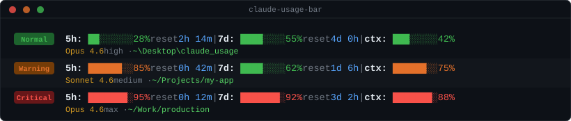

# claude-usage-bar

A persistent status bar for **Claude Code CLI** that shows your account's rate limit usage (5h and 7d windows), current session context, countdown to reset, and current session details — just like the "Usage" page in Claude settings.

The bar updates automatically after every response, right below the input box.

Also using **Codex CLI**? Check out [codex-usage-bar](https://github.com/bhutano/codex-usage-bar): the same compact usage-bar idea, rebuilt around Codex CLI's local session logs.

> 🌐 [Leggi in italiano](#italiano)

---

## Preview



<details>
<summary>Plain text preview (no color)</summary>

```
Normal   │ 5h: ██░░░░░░ 28%  reset 2h 14m  |  7d: ████░░░░ 55%  reset 4d 0h  |  ctx: ███░░░░░ 42%
         │ Opus 4.6 high · ~\Desktop\claude_usage
Warning  │ 5h: ██████░░ 85%  reset 0h 42m  |  7d: ████░░░░ 62%  reset 1d 6h  |  ctx: ██████░░ 75%
         │ Sonnet 4.6 medium · ~/Projects/my-app
Critical │ 5h: ███████░ 95%  reset 0h 12m  |  7d: ███████░ 92%  reset 3d 2h  |  ctx: ███████░ 88%
         │ Opus 4.6 max · ~/Work/production
```

</details>

---

## Fields

| Field | Meaning | Color thresholds |
|-------|---------|-----------------|
| **5h** | Rate limit over the last 5 hours (daily proxy) | green < 80% · orange 80–90% · red ≥ 90% |
| **7d** | Weekly rate limit | green < 80% · orange 80–90% · red ≥ 90% |
| **ctx** | Context window usage for the current session | green < 70% · orange 70–80% · red > 80% |
| **reset** | Countdown to limit reset | hours/minutes if < 24h · days and hours if ≥ 24h |
| **session details** | Current model, reasoning effort, and working directory | second line: yellow model, bright-green directory; the home directory is shortened to `~` |

> **Note:** `5h` and `7d` show real data only with a **Claude.ai Pro or Max** plan.
> They will appear as `N/A` when using a standalone API key.

---

## Requirements

- [Claude Code CLI](https://claude.ai/code) installed
- Python 3.6+ for the Bash renderer (the native PowerShell renderer does not require Python)
- **Claude.ai Pro or Max** plan for rate limit data

---

## Installation

### Option 1 — Automatic (recommended)

**macOS / Linux / Git Bash / WSL:**

```bash
git clone https://github.com/bhutano/claude-usage-bar.git
cd claude-usage-bar
bash install.sh
```

**Native Windows PowerShell:**

```powershell
git clone https://github.com/bhutano/claude-usage-bar.git
cd claude-usage-bar
powershell.exe -NoProfile -ExecutionPolicy Bypass -File .\install.ps1
```

Both installers ask you to choose a language, then set everything up automatically. The PowerShell installer backs up an existing `settings.json` as `settings.json.bak` before changing it.

Then **restart Claude Code**.

> **Windows:** use `install.ps1` for a native Windows Claude Code. Only use **WSL**
> if Claude Code also runs inside WSL — otherwise the status bar
> installs into WSL's Linux home (`/home/<you>/.claude`) and Windows Claude Code
> won't see it.

### Option 2 — Manual

1. Copy `statusline-usage.sh` to `~/.claude/` and make it executable:
   ```bash
   cp statusline-usage.sh ~/.claude/statusline-usage.sh
   chmod +x ~/.claude/statusline-usage.sh
   ```

2. Copy the config file:
   ```bash
   cp usage-bar.conf ~/.claude/usage-bar.conf
   ```

3. Add to `~/.claude/settings.json`:
   ```json
   {
     "statusLine": {
       "type": "command",
       "command": "~/.claude/statusline-usage.sh"
     }
   }
   ```

4. Restart Claude Code.

On native Windows, copy `statusline-usage.ps1` to `%USERPROFILE%\.claude\` and use this command instead:

```json
{
  "statusLine": {
    "type": "command",
    "command": "powershell.exe -NoProfile -ExecutionPolicy Bypass -File \"C:\\Users\\<you>\\.claude\\statusline-usage.ps1\""
  }
}
```

### Option 3 — Skill `/usage-bar`

Copy the repo folder into `~/.claude/skills/`:

```bash
cp -r . ~/.claude/skills/usage-bar
```

Then type `/usage-bar` inside Claude Code to install everything automatically.

---

## Changing the language

### Method 1 — Edit the config file

Open `~/.claude/usage-bar.conf` and change the `LANG` line:

```ini
LANG=en   # English
LANG=it   # Italiano
```

No restart needed — the change takes effect on the next response.

### Method 2 — Re-run the installer

```bash
bash install.sh --lang it
```

### Method 3 — Per-session environment variable

Override the language for a single session without changing the config:

```bash
USAGE_BAR_LANG=it claude
```

### Method 4 — From inside Claude Code

Type `/usage-bar` and ask Claude to change the language.

---

## Supported languages

| Code | Language  |
|------|-----------|
| `en` | English   |
| `it` | Italiano  |

### Adding a new language

Open `statusline-usage.sh` and add a new entry to the `T` dictionary in the Python block:

```python
T = {
    "en": { ... },
    "it": { ... },
    "fr": {                        # ← add your language here
        "waiting":   "En attente de la première réponse...",
        "reset_now": "réinitialisation maintenant",
        "na":        "N/D",
        "5h":        "5h",
        "7d":        "7j",
        "ctx":       "ctx",
        "reset":     "réinit.",
        "days":      "j",
        "hours":     "h",
        "minutes":   "m",
    },
}
```

Then set `LANG=fr` in `~/.claude/usage-bar.conf`.

---

## How it works

Claude Code pipes a JSON object to the script's stdin after each response. The script extracts rate limits, context usage, model, reasoning effort, and the current working directory, then formats them as a two-line status display.

Relevant JSON fields:

```json
{
  "model": {
    "id": "claude-opus-4-6",
    "display_name": "Opus 4.6"
  },
  "effort": {
    "level": "high"
  },
  "workspace": {
    "current_dir": "/home/user/project"
  },
  "context_window": {
    "used_percentage": 42
  },
  "rate_limits": {
    "five_hour":  { "used_percentage": 28.0, "resets_at": 1743000000 },
    "seven_day":  { "used_percentage": 55.0, "resets_at": 1743500000 }
  }
}
```

---

## File structure

```
claude-usage-bar/
├── README.md               ← this file
├── SKILL.md                ← /usage-bar skill (auto-installer + help)
├── statusline-usage.sh     ← Bash renderer (macOS, Linux, Git Bash, WSL)
├── statusline-usage.ps1    ← native Windows PowerShell renderer
├── usage-bar.conf          ← language config (copy to ~/.claude/)
├── install.sh              ← Bash installer
└── install.ps1             ← native Windows PowerShell installer
```

---

## Compatibility

| Platform | Status |
|----------|--------|
| macOS | ✓ |
| Linux | ✓ |
| Windows (PowerShell) | ✓ |
| Windows (Git Bash / WSL) | ✓ * |

\* Install in the **same** environment where Claude Code runs. For native Windows use PowerShell; only use WSL if Claude Code also runs in WSL.

Python is auto-detected by the Bash renderer (`python3`, `python`, common paths). The native PowerShell renderer has no external dependencies.

---

## Credits

Native PowerShell support is adapted from [RunXPS/claude-usage-bar](https://github.com/RunXPS/claude-usage-bar), commit [`7a82565`](https://github.com/RunXPS/claude-usage-bar/commit/7a825654090d2708dcee85e282e0e5c5bbfdc271), and updated to preserve this project's countdown, thresholds, session details, and safe settings handling.

---

## License

MIT

---

---

<a name="italiano"></a>

# claude-usage-bar — Italiano

Una barra di stato persistente per **Claude Code CLI** che mostra in tempo reale i limiti di utilizzo dell'account (finestre 5h e 7d), la finestra di contesto, il countdown al reset e i dettagli della sessione corrente — esattamente come la pagina "Utilizzo" nelle impostazioni di Claude.

La barra si aggiorna automaticamente dopo ogni risposta, sotto la casella di input.

Usi anche **Codex CLI**? Dai un'occhiata a [codex-usage-bar](https://github.com/bhutano/codex-usage-bar): la stessa idea di barra compatta, ricostruita sui log locali di sessione di Codex CLI.

---

## Anteprima


---

## Campi

| Campo | Significato | Soglie colore |
|-------|-------------|---------------|
| **5h** | Rate limit ultime 5 ore (proxy giornaliero) | verde < 80% · arancione 80–90% · rosso ≥ 90% |
| **7d** | Rate limit settimanale | verde < 80% · arancione 80–90% · rosso ≥ 90% |
| **ctx** | Finestra di contesto della sessione corrente | verde < 70% · arancione 70–80% · rosso > 80% |
| **reset** | Countdown al reset | ore/minuti se < 24h · giorni e ore se ≥ 24h |
| **dettagli sessione** | Modello, effort di ragionamento e cartella di lavoro correnti | seconda riga: modello giallo, cartella verde acceso; la home è abbreviata con `~` |

> **Nota:** `5h` e `7d` mostrano dati reali solo con piano **Claude.ai Pro o Max**.
> Con API key standalone appariranno come `N/A`.

---

## Installazione

### Opzione 1 — Script automatico (consigliato)

**macOS / Linux / Git Bash / WSL:**

```bash
git clone https://github.com/bhutano/claude-usage-bar.git
cd claude-usage-bar
bash install.sh
```

**Windows PowerShell nativo:**

```powershell
git clone https://github.com/bhutano/claude-usage-bar.git
cd claude-usage-bar
powershell.exe -NoProfile -ExecutionPolicy Bypass -File .\install.ps1
```

Entrambi gli installer chiedono la lingua e configurano tutto automaticamente. L'installer PowerShell salva una copia dell'eventuale `settings.json` esistente come `settings.json.bak` prima di modificarlo.

Poi **riavvia Claude Code**.

> **Windows:** usa `install.ps1` per Claude Code nativo. Usa **WSL** solo se anche
> Claude Code gira dentro WSL — altrimenti la barra viene
> installata nella home Linux di WSL (`/home/<tu>/.claude`) e il Claude Code di
> Windows non la vedrà.

### Opzione 2 — Manuale

1. Copia `statusline-usage.sh` in `~/.claude/` e rendilo eseguibile:
   ```bash
   cp statusline-usage.sh ~/.claude/statusline-usage.sh
   chmod +x ~/.claude/statusline-usage.sh
   ```

2. Copia il file di configurazione:
   ```bash
   cp usage-bar.conf ~/.claude/usage-bar.conf
   ```

3. Aggiungi a `~/.claude/settings.json`:
   ```json
   {
     "statusLine": {
       "type": "command",
       "command": "~/.claude/statusline-usage.sh"
     }
   }
   ```

4. Riavvia Claude Code.

Su Windows nativo copia invece `statusline-usage.ps1` in `%USERPROFILE%\.claude\` e configura `statusLine` per eseguire:

```text
powershell.exe -NoProfile -ExecutionPolicy Bypass -File "C:\Users\<utente>\.claude\statusline-usage.ps1"
```

---

## Cambiare la lingua

### Metodo 1 — Modifica il file di configurazione

Apri `~/.claude/usage-bar.conf` e cambia la riga `LANG`:

```ini
LANG=en   # English
LANG=it   # Italiano
```

Non serve riavviare — la modifica è attiva dalla risposta successiva.

### Metodo 2 — Reinstalla con lingua diversa

```bash
bash install.sh --lang en
```

### Metodo 3 — Variabile d'ambiente per sessione singola

```bash
USAGE_BAR_LANG=en claude
```

### Metodo 4 — Da Claude Code

Scrivi `/usage-bar` e chiedi a Claude di cambiare la lingua.

---

## Aggiungere una nuova lingua

Apri `statusline-usage.sh` e aggiungi una nuova voce nel dizionario `T` nel blocco Python:

```python
T = {
    "en": { ... },
    "it": { ... },
    "fr": {                        # ← aggiungi qui la tua lingua
        "waiting":   "En attente de la première réponse...",
        "reset_now": "réinitialisation maintenant",
        "na":        "N/D",
        "5h":        "5h",
        "7d":        "7j",
        "ctx":       "ctx",
        "reset":     "réinit.",
        "days":      "j",
        "hours":     "h",
        "minutes":   "m",
    },
}
```

Poi imposta `LANG=fr` in `~/.claude/usage-bar.conf`.
